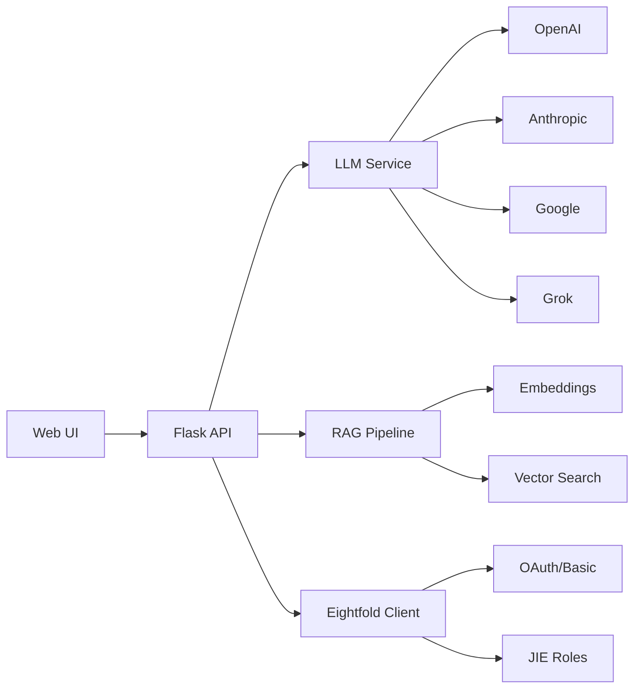

# System Patterns - Skills Proficiency Generator

## System Architecture

### Layered Architecture
```
┌─────────────────────────────────────┐
│         Web Layer (Flask)           │
├─────────────────────────────────────┤
│      Service Layer (Python)         │
├─────────────────────────────────────┤
│   Integration Layer (API Clients)   │
├─────────────────────────────────────┤
│     Data Layer (RAG Pipeline)       │
└─────────────────────────────────────┘
```

### Component Relationships

#### Core Flow


## Key Technical Decisions

### 1. Session-Based State Management
- **Pattern**: Store API keys in session memory only
- **Rationale**: Security - no persistent credential storage
- **Implementation**: Flask session with secure cookies
- **Trade-off**: Keys must be re-entered after restart

### 2. Direct API Integration
- **Pattern**: Call Eightfold APIs directly from frontend
- **Rationale**: Transparency and debugging capability
- **Implementation**: No backend wrappers, full request visibility
- **Trade-off**: More complex frontend, but better control

### 3. Multi-Method Assessment
- **Pattern**: Parallel execution of three assessment methods
- **Rationale**: Validation through consensus
- **Implementation**: Async processing with result aggregation
- **Trade-off**: Higher computational cost for better accuracy

### 4. Embedding Cache Strategy
- **Pattern**: Persist embeddings to disk
- **Rationale**: Expensive to regenerate
- **Implementation**: PyTorch tensor serialization
- **Trade-off**: Disk space for performance

## Design Patterns in Use

### Factory Pattern - LLM Service
```python
class LLMServiceFactory:
    @staticmethod
    def create(provider: str) -> BaseLLM:
        if provider == "openai":
            return OpenAIService()
        elif provider == "anthropic":
            return AnthropicService()
        # ...
```

### Strategy Pattern - Assessment Methods
```python
class AssessmentStrategy:
    def assess(self, resume: str) -> Dict

class DirectLLMStrategy(AssessmentStrategy):
    def assess(self, resume: str) -> Dict

class RAGEnhancedStrategy(AssessmentStrategy):
    def assess(self, resume: str) -> Dict

class BarebonesStrategy(AssessmentStrategy):
    def assess(self, resume: str) -> Dict
```

### Singleton Pattern - Environment Manager
```python
class EnvironmentManager:
    _instance = None
    
    def __new__(cls):
        if cls._instance is None:
            cls._instance = super().__new__(cls)
        return cls._instance
```

### Observer Pattern - Progress Monitoring
```python
class ProgressMonitor:
    def __init__(self):
        self.observers = []
    
    def attach(self, observer):
        self.observers.append(observer)
    
    def notify(self, progress):
        for observer in self.observers:
            observer.update(progress)
```

## API Integration Patterns

### Authentication Flow
```python
# OAuth2 Flow
1. Request token with credentials
2. Store token in session
3. Use token for API calls
4. Refresh when expired

# Basic Auth Flow
1. Encode credentials
2. Add to Authorization header
3. Make API request
4. Handle response
```

### Error Handling Strategy
```python
try:
    response = api_call()
    if response.status_code == 200:
        return process_success(response)
    elif response.status_code == 401:
        return handle_auth_error()
    elif response.status_code == 429:
        return handle_rate_limit()
    else:
        return handle_general_error(response)
except Timeout:
    return handle_timeout()
except ConnectionError:
    return handle_connection_error()
```

### Caching Strategy
```python
# Three-tier caching
1. Memory cache (instant, limited size)
2. Disk cache (fast, persistent)
3. Regeneration (slow, always available)

cache_hierarchy = [
    MemoryCache(ttl=300),      # 5 minutes
    DiskCache(ttl=3600),       # 1 hour
    RegenerateFunction()        # Fallback
]
```

## Data Flow Patterns

### Assessment Pipeline
```
Input -> Validation -> Processing -> Aggregation -> Output
  │          │            │             │            │
  └──────────┴────────────┴─────────────┴────────────┘
                    Error Recovery Path
```

### RAG Enhancement Flow
```
1. Extract text from resume
2. Generate embeddings
3. Search vector database
4. Retrieve similar contexts
5. Augment LLM prompt
6. Generate assessment
```

### Multi-Environment Support
```python
ENVIRONMENT_CONFIG = {
    "US": {
        "base_url": "https://apiv2.eightfold.ai",
        "auth_endpoint": "/oauth/v1/authenticate"
    },
    "EU": {
        "base_url": "https://apiv2.eightfold-eu.ai",
        "auth_endpoint": "/oauth/v1/authenticate"
    }
}
```

## Performance Patterns

### Parallel Processing
```python
async def parallel_assess(resume: str):
    tasks = [
        direct_llm_assess(resume),
        rag_enhanced_assess(resume),
        barebones_assess(resume)
    ]
    results = await asyncio.gather(*tasks)
    return aggregate_results(results)
```

### Lazy Loading
```python
class EmbeddingManager:
    def __init__(self):
        self._embeddings = None
    
    @property
    def embeddings(self):
        if self._embeddings is None:
            self._embeddings = self._load_embeddings()
        return self._embeddings
```

### Connection Pooling
```python
# Reuse HTTP connections
session = requests.Session()
session.mount('https://', HTTPAdapter(
    pool_connections=10,
    pool_maxsize=10,
    max_retries=3
))
```

## Security Patterns

### Credential Management
```python
# Never store in code
API_KEY = os.environ.get('API_KEY')  # Bad
API_KEY = session.get('api_key')     # Good

# Always validate
if not is_valid_api_key(api_key):
    raise InvalidCredentialsError()
```

### Input Validation
```python
# Sanitize all inputs
def validate_resume(text: str) -> str:
    # Remove potential injections
    text = sanitize_html(text)
    text = remove_scripts(text)
    text = truncate_length(text, MAX_LENGTH)
    return text
```

### Rate Limiting
```python
from functools import wraps
from time import time

def rate_limit(calls=10, period=60):
    def decorator(func):
        timestamps = []
        
        @wraps(func)
        def wrapper(*args, **kwargs):
            now = time()
            timestamps[:] = [t for t in timestamps if t > now - period]
            if len(timestamps) >= calls:
                raise RateLimitError()
            timestamps.append(now)
            return func(*args, **kwargs)
        return wrapper
    return decorator
```